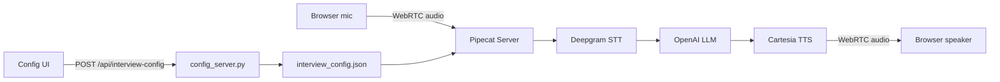

# 🎙️ Pipecat AI Interview Coach

A real-time voice interview coach powered by [Pipecat](https://github.com/pipecat-ai/pipecat). Practice technical interviews with an AI interviewer that listens, responds with natural speech, and adapts its tone and questions based on a job description you provide.

## 🌟 Features

- **Real-time voice interaction** — speak naturally; the bot listens and replies with spoken audio over WebRTC
- **Configurable interviewer personality** — choose **Friendly**, **Decent**, or **Strict** bot nature
- **Job-description-aware interviews** — paste a JD; the bot asks relevant technical and behavioral questions
- **Live conversation UI** — transcript panel, event logs, mic controls, and connection status
- **SmallWebRTC transport** — local real-time audio between browser and WSL server (no Daily account needed)
- **Separate config API** — save interview settings before starting a session

> **Note:** This project runs on **SmallWebRTC only**. Daily transport is present in upstream Pipecat example code but is **not used or supported** in this setup (requires extra dependencies and was not reliable in our environment).

## 🛠️ Tech Stack

| Layer | Technology |
|-------|------------|
| **Voice framework** | Pipecat |
| **Speech-to-text** | Deepgram |
| **LLM** | OpenAI (`gpt-4.1` via Responses API) |
| **Text-to-speech** | Cartesia |
| **Realtime transport** | SmallWebRTC (WebRTC) |
| **Config server** | aiohttp |
| **Frontend** | Vanilla JS + Vite + Pipecat Client SDK |
| **Backend** | Python 3.11+ · uv |

## 📁 Project Structure

```
Pipecat_AI_Interview_Coach/
├── simple-chatbot/
│   ├── server/
│   │   ├── bot-openai.py        # Main voice bot (WebRTC)
│   │   ├── config_server.py     # REST API for JD & bot nature
│   │   ├── bot.py               # Legacy reference (Daily — not used)
│   │   ├── run-webrtc.sh        # WSL startup script
│   │   ├── interview_config.json # Saved interview settings (generated)
│   │   ├── assets/              # Sprite assets (legacy Daily example)
│   │   └── pyproject.toml
│   └── client/
│       ├── index.html           # Interview UI (JD + bot nature)
│       ├── src/
│       │   ├── app.js           # Pipecat client logic
│       │   ├── config.js        # Transport configuration
│       │   └── style.css
│       └── package.json
├── wslconfig.example            # WSL mirrored networking template
└── README.md
```

## 🚀 Getting Started

### Prerequisites

- **Python 3.11+**
- **Node.js 18+** (only if running the Vite dev client on port 5173)
- **uv** — [install guide](https://docs.astral.sh/uv/)
- API keys: **OpenAI**, **Deepgram**, **Cartesia** (WebRTC mode)
- **WSL2 (Ubuntu)** recommended on Windows for stable WebRTC audio
- Chrome with microphone access

### Installation

1. **Clone the repository**

   ```bash
   git clone https://github.com/deep1305/pipecat-ai-interview-coach.git
   cd pipecat-ai-interview-coach/simple-chatbot/server
   ```

2. **Install Python dependencies**

   ```bash
   uv sync
   ```

3. **Configure environment variables**

   Create `simple-chatbot/server/.env`:

   ```env
   # Required
   OPENAI_API_KEY=your_openai_api_key
   OPENAI_MODEL=gpt-4.1
   DEEPGRAM_API_KEY=your_deepgram_api_key
   CARTESIA_API_KEY=your_cartesia_api_key
   CARTESIA_VOICE_ID=your_cartesia_voice_id

   # Config server
   CONFIG_SERVER_PORT=7861
   CONFIG_SERVER_HOST=0.0.0.0
   ```

4. **WSL networking (Windows users)**

   Copy `wslconfig.example` to `C:\Users\smart\.wslconfig`, then restart WSL:

   ```powershell
   wsl --shutdown
   ```

   For best WebRTC performance, copy the project to native WSL (avoid OneDrive paths):

   ```bash
   cp -r "/mnt/c/.../Pipecat_AI_Interview_Coach" ~/Pipecat_AI_Interview_Coach
   cd ~/Pipecat_AI_Interview_Coach/simple-chatbot/server
   uv sync
   ```

### Run the application

**Option A — Single command (recommended on WSL)**

```bash
cd simple-chatbot/server
bash run-webrtc.sh
```

Open in Windows Chrome: **http://localhost:7860/client**

**Option B — Three terminals (Vite dev client)**

```bash
# Terminal 1 — config server
cd simple-chatbot/server
uv run config_server.py

# Terminal 2 — voice bot
uv run bot-openai.py --transport webrtc --host 0.0.0.0

# Terminal 3 — frontend dev server
cd simple-chatbot/client
npm install
npm run dev
```

Open: **http://localhost:5173**

## 💡 Usage

1. **SmallWebRTC** is the only supported transport (already the default in `client/src/config.js`).
2. Choose **Bot Nature**: Friendly · Decent · Strict.
3. Paste a **Job Description** (minimum 50 characters).
4. Click **Connect** and allow microphone access.
5. Click anywhere on the page once if audio does not play (Chrome autoplay unlock).
6. Answer the bot's questions out loud — replies appear in the conversation panel.

### Example job description

```
Senior Frontend Engineer — React & TypeScript

Build scalable UI components, write tests with Jest, collaborate with backend
teams, and optimize performance. Requires 4+ years React/TypeScript experience.
```

## 📊 How It Works



1. **Config** — Client sends bot nature + JD to the config server; settings are saved to `interview_config.json`.
2. **Connect** — Browser establishes a SmallWebRTC session with the Pipecat runner on port 7860.
3. **Listen** — User speech is transcribed by Deepgram.
4. **Think** — OpenAI generates the next interview question using a system prompt built from bot nature and JD.
5. **Speak** — Cartesia converts the reply to audio and streams it back over WebRTC.

## 🔧 API Reference

| Endpoint | Method | Description |
|----------|--------|-------------|
| `/api/interview-config` | POST | Save `{ "botNature": "decent", "jd": "..." }` |
| `/health` | GET | Config server health check |

Default config server: `http://localhost:7861`

## 🐳 Docker

A Dockerfile is included under `simple-chatbot/server/` for containerized deployment. Build and run:

```bash
cd simple-chatbot/server
docker build -t pipecat-interview-coach .
docker run -p 7860:7860 -p 7861:7861 --env-file .env pipecat-interview-coach
```

## ⚠️ Troubleshooting

| Issue | Fix |
|-------|-----|
| No audio from bot | Use `localhost:7860/client`, not the LAN IP. Enable WSL mirrored networking. Click the page after connect. |
| Slow WebRTC / disconnects | Run from `~/Pipecat_AI_Interview_Coach`, not `/mnt/c/OneDrive/...` |
| Client stuck on Daily transport | Daily is not supported. Ensure `DEFAULT_TRANSPORT = 'smallwebrtc'` in `client/src/config.js` and only SmallWebRTC is listed in `AVAILABLE_TRANSPORTS`. |
| `No module named 'daily'` | Do not use Daily mode. Run with `--transport webrtc` only. |
| Daily connect hangs forever | Expected — Daily is not configured for this project. Use SmallWebRTC instead. |

## 🙏 Acknowledgments

- Built on [Pipecat](https://github.com/pipecat-ai/pipecat) and [pipecat-examples](https://github.com/pipecat-ai/pipecat-examples)
- Voice services: Deepgram · OpenAI · Cartesia

---

**Made for interview prep — practice out loud, get better answers.**
